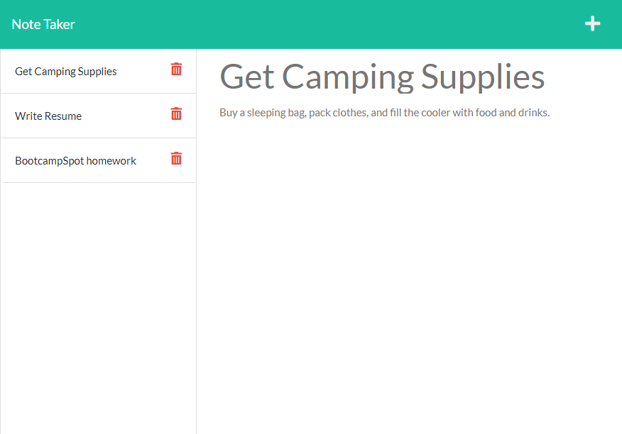

# Note-Taker

[](https://opensource.org/licenses/MIT)

## Description
Note-Taker is a full stack app which allows the user to collect, store, and manage notes and reminders for themselves!

## Table of Contents
* [Installation](#installation)
* [Usage](#usage)
* [License](#license)
* [Contributing](#contributing)
* [Tests](#tests)
* [Questions and Contact Info](#questions-and-contact-info)



## Installation
No installation required! Simply visit [this website!](https://note-taker-krauzowicz.herokuapp.com/)

## Usage
As this is not a published package, it must be ran by opening the project in an IDE of your choice and using ```node index.js```

## License
This project is licensed under 'MIT'. Please see LICENSE file for more info.

## Contributing
Contributions are not open at this time.

## Tests
There are no tests to run prior to running.

## Questions and Contact Info
* Github: https://github.com/mlkrauz
* Email: mlkrauz@protonmail.com